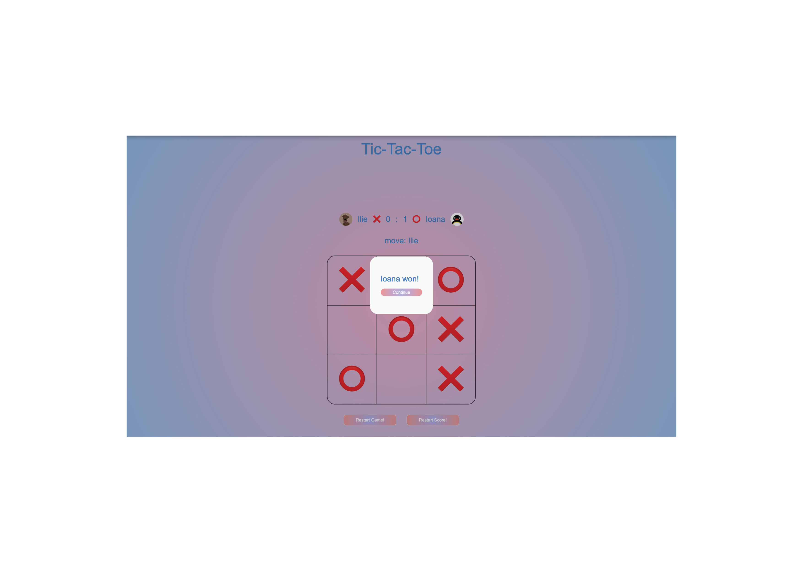
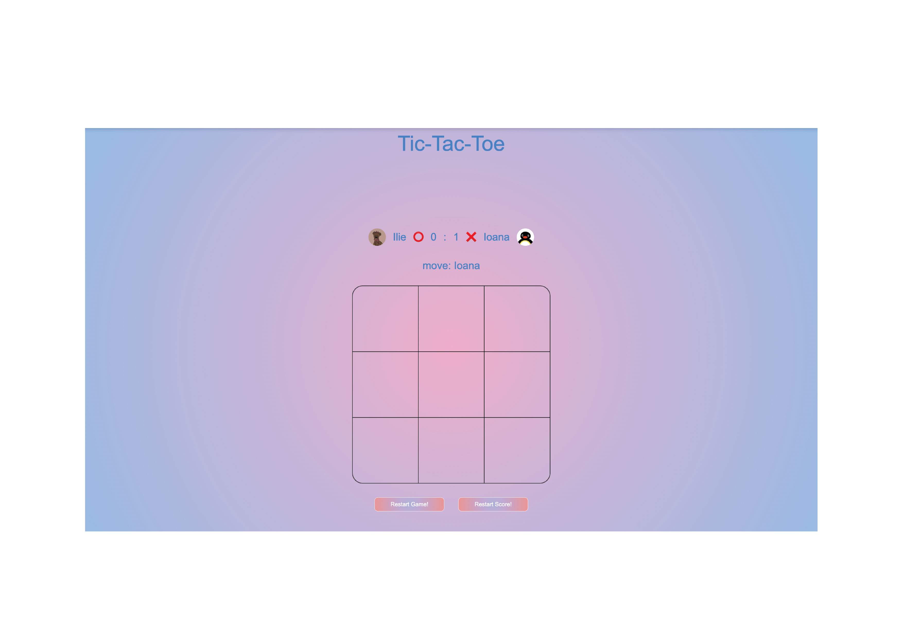
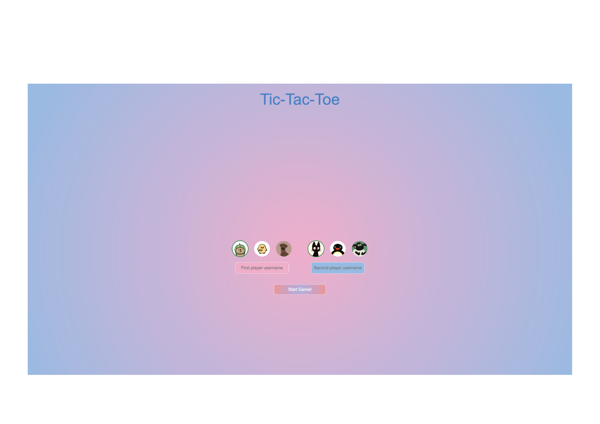
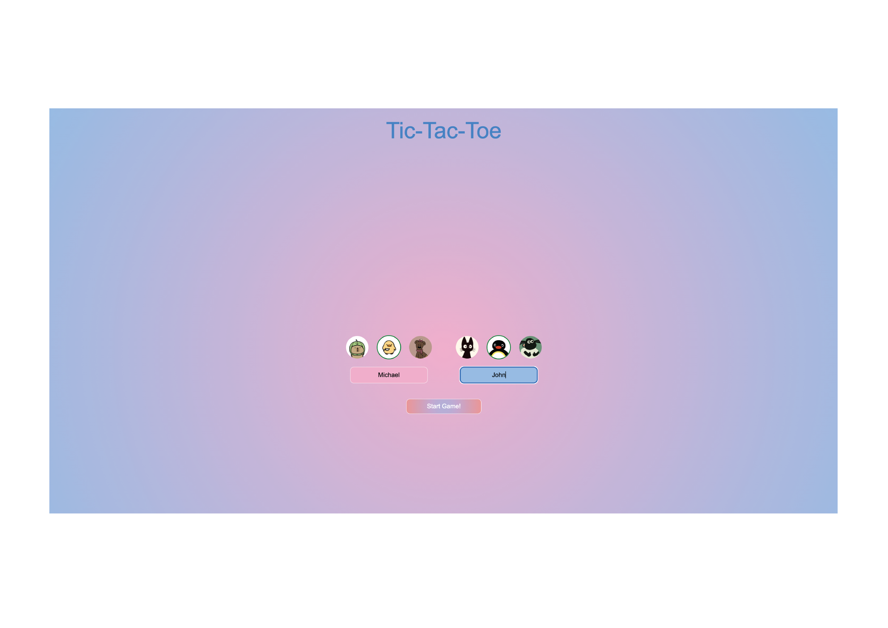

#Assignment 02

##Brief

Choose a “mini-game” to rebuild with HTML, CSS and JavaScript. The requirements are:

- The webpage should be responsive
- Choose an avatar at the beginning of the game
- Keep track of the score of the player
- Use the keyboard to control the game (indicate what are the controls in the page). You can also use buttons (mouse), but also keyboard.
- Use some multimedia files (audio, video, …)
- Implement an “automatic restart” in the game (that is not done via the refresh of the page)

## Project description

TicTacToe is the digital version of the classical pen & paper TicTacToe. This minigame can be played by two players.

At the first-step of the game the players have to choose an avatar from the ones that are given to them and then to write their username.

After these two steps are done, they can start the actual game.

The minigame itself is played like the classical one, the winner being the player that manages to get three Xs or Os on a row/column/diagonal. They can place the X or O symbol either by using the mouse or by pressing the 1 to 9 keys.

When one player wins, a victory sound will be heard and then the symbols switches. If on the anterior round player 1 used X and player 2 used O, in the second round, the symbols will automatically change. Also the score will be automatically changed. 

## Screenshots

## Flowchart

## Function list

Function: startGame()

Parameters: none

Return: none

Description:
Initializes the game. Saves the usernames, updates UI with player information, resets score and table, sets player symbols, and switches to the game screen. Enables gameplay.

Function: resetAvatars(side)

Parameters: side (string — 'left' or 'right')

Return: none

Description:
Removes the selected class from all avatar options on the chosen side so a new avatar can be selected.

Function: selectAvatar(side, elementId)

Parameters: 
side (string — 'left' or 'right')

elementId (string — DOM element ID of the selected avatar)

Return: none

Description:
Calls resetAvatars(), then assigns the selected avatar to the correct player and adds the selected class to the chosen element.

Function: move(row, column)

Parameters: 
row (number 0–2)

column (number 0–2)

Return: none

Description:
Places a symbol ❌ or ⭕ in the selected table cell if it is empty and the game is active. Switches turns, updates the UI, and calls checkWin().

Function: resetGame()

Parameters: none

Return: none

Description:
Returns to the first step of the game setup. Clears usernames, resets avatar selections, and hides the board.

Function:resetScore()

Parameters: none

Return: none

Description:
Sets both players’ points to 0 and updates the UI.

Function: continueGame()

Parameters: none

Return: none

Description:
Closes the overlay dialog, resets the board, swaps the symbol of each player (X becomes O and vice-versa), updates who moves next, and reactivates gameplay.

Function: checkWin()

Parameters: none

Return: none

Description:

Checks every row, column, and diagonal to determine whether a player has won.
If a player wins, it adds a point, plays the victory sound, and opens the dialog.
If the board is full and nobody wins, declares a tie.

Function: openDialog(message)

Parameters: message (string)

Return: none

Description:
Displays the winning/tie message overlay and stops gameplay.

Function: resetTable()

Parameters: none

Return: none

Description:
Clears the table matrix and the displayed symbols in every board cell.

Function: document.addEventListener('keydown', callback)

Description:
When the user presses keys 0 to 9, the event retrieves the corresponding board index, converts it into (row, column), and calls the move() function to place the symbol.

## Content and data source

Win sound - https://pixabay.com/sound-effects/search/victory/

Avatar images - 
https://ro.pinterest.com/pin/697072848629059328/
https://ro.pinterest.com/pin/47428602325425710/
https://ro.pinterest.com/pin/420594052724388452/
https://ro.pinterest.com/pin/27725353952013640/
https://ro.pinterest.com/pin/281543726161305/
https://ro.pinterest.com/pin/3588874697996932/

