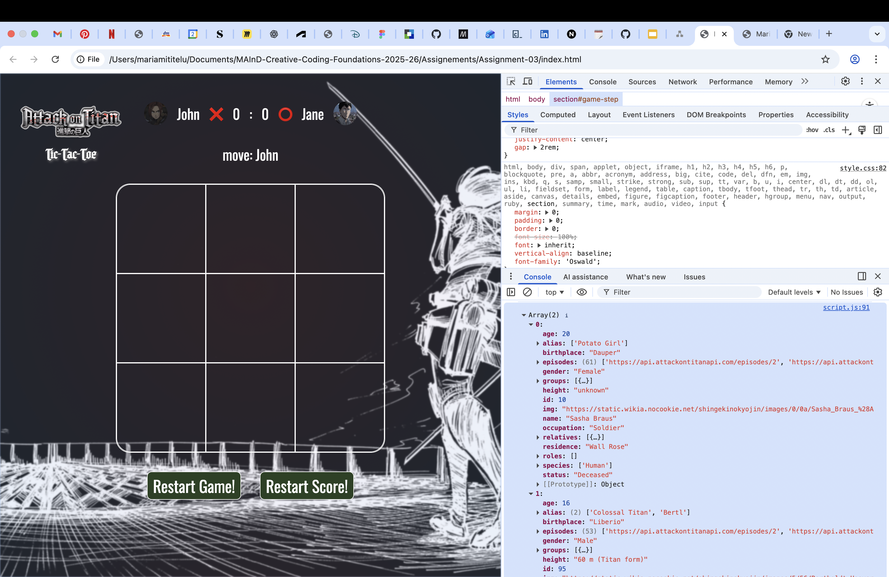

#Assignment 02

##Brief

Upgrade the **Assignment 02** by adding the use of data coming from an external web API. For example, fetch contents (audio, images, video, text, metadata) from online archives, AI generated contents (chatGPT API), data (weather, realtime traffic data, environmental data).

The application **must** have those requirements:

- The webpage is responsive
- Use a web API (you choose which one best fists for your project) to load the data and display them in the webpage
- At least one multimedia file (for user feedback interactions, or content itself)
- Develop a navigation system that allows the user to navigate different sections with related content and functionalities

## Screenshots

## Project description

Attack on Titan TicTacToe is the digital version of the classical pen & paper TicTacToe, but inspired from the famous japanese anime series Attack on Titan. This minigame can be played by two players.

At the first-step of the game the players have to choose an avatar from the dropdown list of character names and then to write their username.

After these two steps are done, they can start the actual game.

The minigame itself is played like the classical one, the winner being the player that manages to get three Xs or Os on a row/column/diagonal. They can place the X or O symbol either by using the mouse or by pressing the 1 to 9 keys.

When one player wins, a victory sound will be heard and then the symbols switches. If on the anterior round player 1 used X and player 2 used O, in the second round, the symbols will automatically change. Also the score will be automatically changed. 

## Flowchart

## Function list

Function: startGame()

Parameters: none

Return: none

Description:
Initializes the game. Saves the usernames, updates UI with player information, resets score and table, sets player symbols, and switches to the game screen. Enables gameplay.

Function: move(row, column)

Parameters: 
row (number 0–2)

column (number 0–2)

Return: none

Description:
Places a symbol ❌ or ⭕ in the selected table cell if it is empty and the game is active. Switches turns, updates the UI, and calls checkWin().

Function: resetGame()

Parameters: none

Return: none

Description:
Returns to the first step of the game setup. Clears usernames, resets avatar selections, and hides the board.

Function:resetScore()

Parameters: none

Return: none

Description:
Sets both players’ points to 0 and updates the UI.

Function: continueGame()

Parameters: none

Return: none

Description:
Closes the overlay dialog, resets the board, swaps the symbol of each player (X becomes O and vice-versa), updates who moves next, and reactivates gameplay.

Function: checkWin()

Parameters: none

Return: none

Description:

Checks every row, column, and diagonal to determine whether a player has won.
If a player wins, it adds a point, plays the victory sound, and opens the dialog.
If the board is full and nobody wins, declares a tie.

Function: openDialog(message)

Parameters: message (string)

Return: none

Description:
Displays the winning/tie message overlay and stops gameplay.

Function: resetTable()

Parameters: none

Return: none

Description:
Clears the table matrix and the displayed symbols in every board cell.

Function: document.addEventListener('keydown', callback)

Description:
When the user presses keys 0 to 9, the event retrieves the corresponding board index, converts it into (row, column), and calls the move() function to place the symbol.

## Content and data source

Win sound - https://www.myinstants.com/en/search/?name=sasageyo
Logo - https://logos-world.net/attack-on-titan-logo/
Fonts:
https://fonts.google.com/specimen/Oswald?categoryFilters=Sans+Serif:%2FSans%2FGrotesque
https://www.fontget.com/font/attack-on-titan/

Background & avatar images -
https://alphacoders.com/attack-on-titan-wallpapers
https://www.attackontitanapi.com/docs/characters

API link - https://api.attackontitanapi.com

## API documentation
endpoint - GET https://api.attackontitanapi.com/characters/[character_id],[character_id]...
Get multiple characters by adding an list of ids as the request parameter /characters/188,1.

Response is an array containing character data 
(e.g: GET https://api.attackontitanapi.com/characters/188,1

[
    {
      "id": 59,
      "name": "Duran",
      "img": "https://static.wikia.nocookie.net/shingekinokyojin/images/b/b2/Duran_%28Anime%29_character_image.png/revision/latest/scale-to-width-down/350?cb=20180730213708",
      "alias": [],
      "species": [
        "Human"
      ],
      "gender": "Male",
      "age": null,
      "height": null,
      "relatives": [],
      "birthplace": null,
      "residence": "Wall Sina",
      "status": "Deceased",
      "occupation": "Soldier",
      "groups": [
        {
          "name": "Military Police Regiment",
          "sub_groups": [
            "Anti-Personnel Control Squad"
          ]
        }
      ],
      "roles": [],
      "episodes": [
        "https://api.attackontitanapi.com/episodes/38",
        "https://api.attackontitanapi.com/episodes/39",
        "https://api.attackontitanapi.com/episodes/43"
      ]
    },
    {
      "id": 188,
      "name": "Eren Jaeger",
      "img": "https://static.wikia.nocookie.net/shingekinokyojin/images/a/a1/Eren_Jaeger_%28Anime%29_character_image.png/revision/latest/scale-to-width-down/350?cb=20220123225500",
      "alias": [
        "Suicidal Maniac",
        "Titan boy",
        "Attack Titan",
        "Mysterious Titan",
        "Berserk Titan",
        "Founding Titan",
        "Founder",
        "Mister Kruger",
        "Usurper",
        "War Hammer Titan",
        "Doomsday Titan"
      ],
      "species": [
        "Human",
        "Intelligent Titan"
      ],
      "gender": "Male",
      "age": 19,
      "height": "15 m (Titan form)",
      "relatives": [
        {
          "family": "Jaeger family",
          "members": [
            "https://api.attackontitanapi.com/characters/160",
            "https://api.attackontitanapi.com/characters/161",
            "https://api.attackontitanapi.com/characters/184",
            "https://api.attackontitanapi.com/characters/173",
            "Unnamed grandmother",
            "https://api.attackontitanapi.com/characters/181"
          ]
        }
      ],
      "birthplace": "Shiganshina District",
      "residence": "Wall Rose",
      "status": "Alive",
      "occupation": "Soldier",
      "groups": [],
      "roles": [
        "Attack Titans",
        "Founding Titans",
        "War Hammer Titans"
      ],
      "episodes": [
        "https://api.attackontitanapi.com/episodes/1",
        "https://api.attackontitanapi.com/episodes/2",
        "https://api.attackontitanapi.com/episodes/3",
        // ...
      ]
    }
]

)

